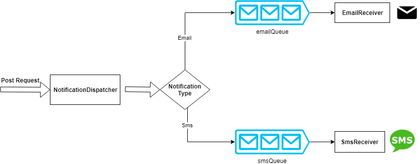

# Notifications By Azure Function

An example of using azure functions as a simply way to notify users either by e-mail or SMS.<br/>

<br/>
## What do we see here?
Three azure functions:
* NotificationDispatcher: triggered by http post request
* EmailReceiver: triggered by email queue 
* SmsReceiver: triggered by sms queue

## How does it work? 
* A client run the NotificationDispatcher by http request
* Based on notification type, the dispatcher put a message in related queue
* Then the queue trigger the it's connected function.

## Example
POST http://localhost:7071/api/NotificationDispatcher<br/>
```json
{
  "NotifyBy": "sms",
  "Receivers": ["0524701332"],
  "Subject": "Get Started with azure function"
}
```
